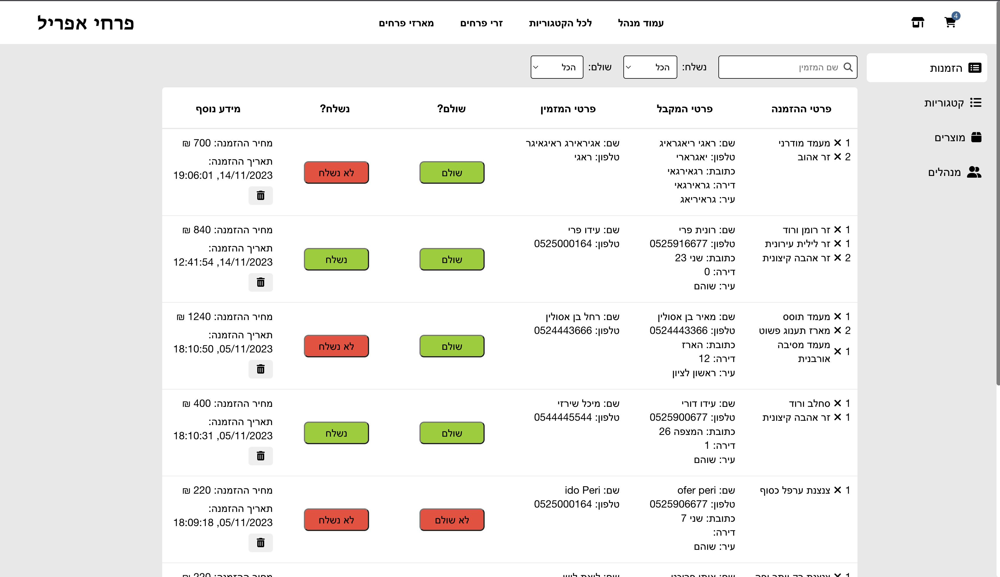
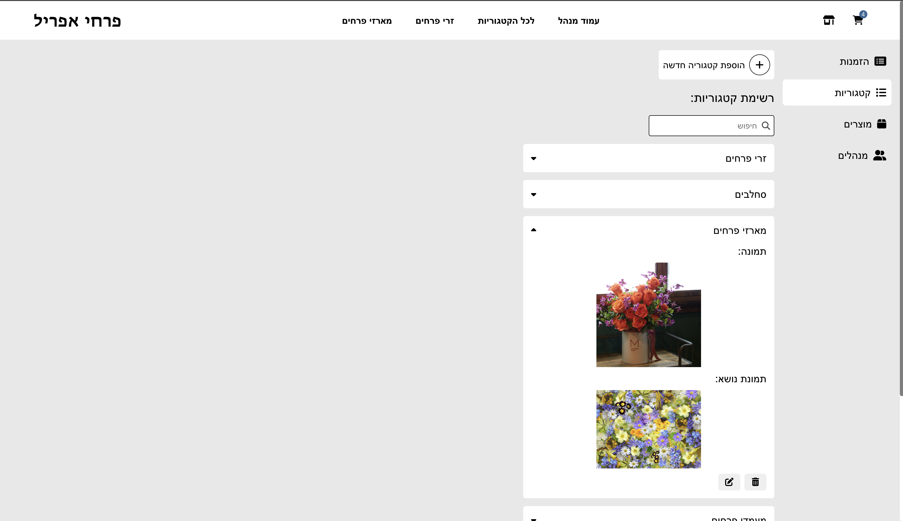
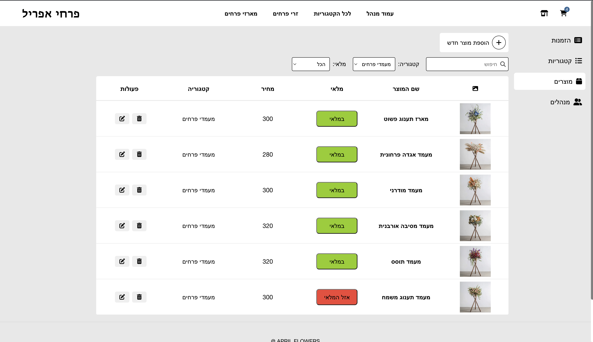
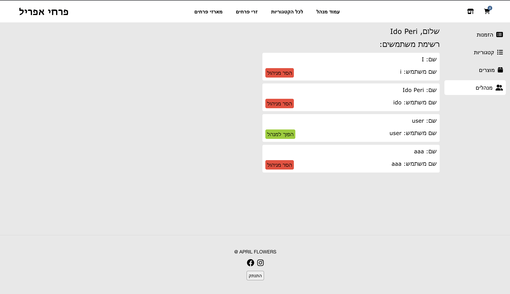
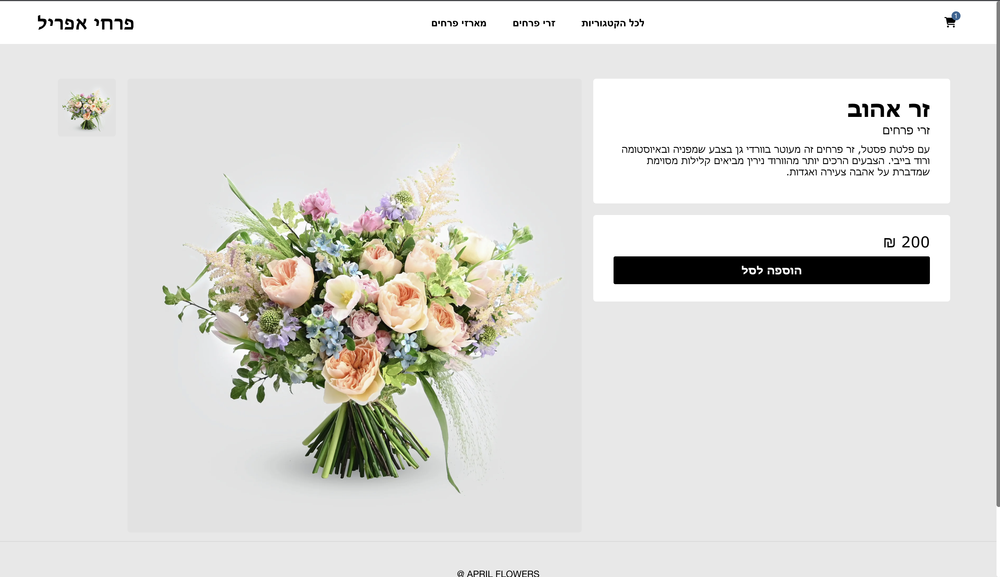
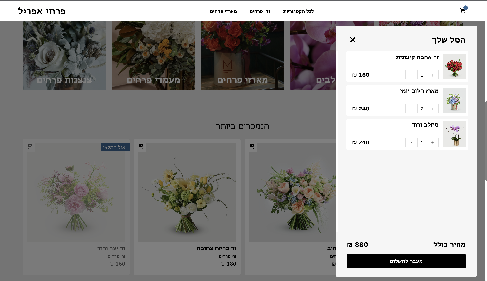
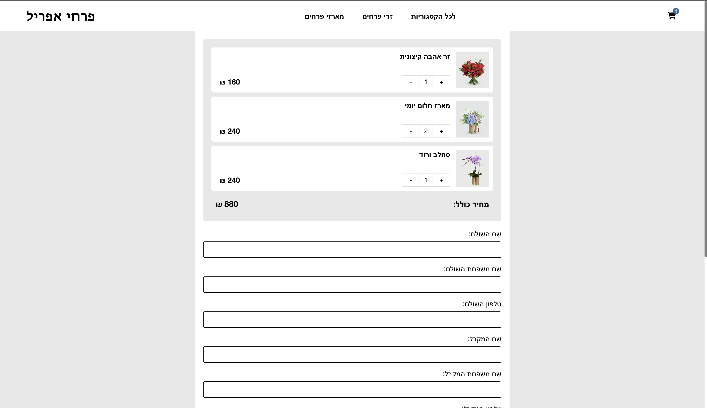
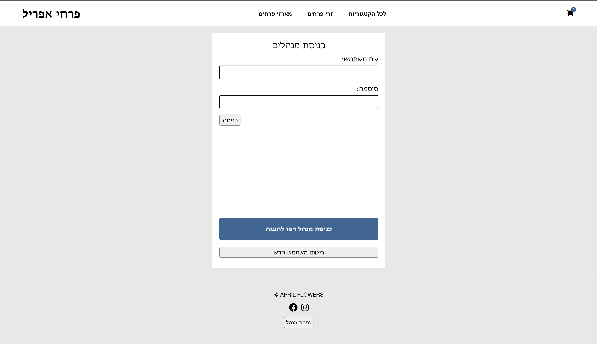

# April Flowers

Welcome to April Flowers, the ultimate online e-commerce flowers store where managers effortlessly control their products, ensuring a seamless and efficient inventory management experience. For users, our platform promises a unique and delightful shopping adventure with an extensive collection of handpicked bouquets. 

The apllication is responsive for all screen sizes. 

You can access the deployed application at https://april-flowers.onrender.com/#/.

## Navigation

- [Features](#features)
- [Technology Stack](#technology-stack)
- [Screenshots](#screenshots)
- [Mobile](#mobile)
- [Getting Started](#getting-started)

## Features
### Admin Panel
- products management.
- categories management.
- orders management.
- managers and users management.

### Online Flowers Store
- Navigation threw different parts of the application.
- Cart for the selected products.
- Home Page, Category Page, Product page, Collections Page.
- Checkout Page.
- User registration and authentication.

## Technology Stack

### Frontend
- React
- Redux
- React Router
- Axios
- Scss

### Backend
- Node.js
- Express
- MongoDB
- bcrypt
- socket.io

## Screenshots - Admin Panel

### Orders Page

The orders page featurs orders management and filtering, and the option to change if the order is paid and shipped.

### Categories Page

The categories page featurs categories management: add, delete, edit, include category image and theme image.

### Products Page

The products page featurs products management: add, delete and edit. include filtering by name, category and stock.

### Managers Page

The managers page featurs managers management: the ability of other admin to make a new user for admin.

## Screenshots

### Home Page

The April Flowers home page features a hero section, descriptin, list of our categories, most popular products and more.

### Collection Page

The collection page features our categoties and our products.

### Category Page

The category page features the products of selected category.

### Product Details Page

The product details page features all the product information, and a action button for adding to cart.

### Cart

The cart featues all the selected products, quantity, price and an action button for checkout.

### Checkout Page

The checkout page allows the user to write the relevant information for the order and to finish the order.

### Login Page

The Login page allows the admin to enter the admin panel, and has a demo login button.

## Mobile

## Getting Started

To run the April Flowers application locally, follow these steps:

1. Clone this repository to your local machine.
2. Navigate to the `april-flowers-backend` directory and run `npm install` to install the backend dependencies.
3. Start the backend server by running `npm run server:dev`.
4. Navigate to the `april-flowers-frontend` directory and run `npm install` to install the frontend dependencies.
5. Start the frontend server by running `npm start`.
6. Open your web browser and navigate to `http://localhost:3000` to access the April Flowers application.
